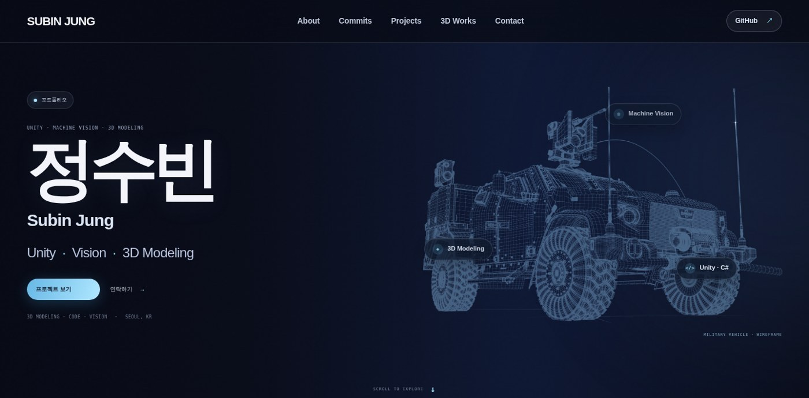
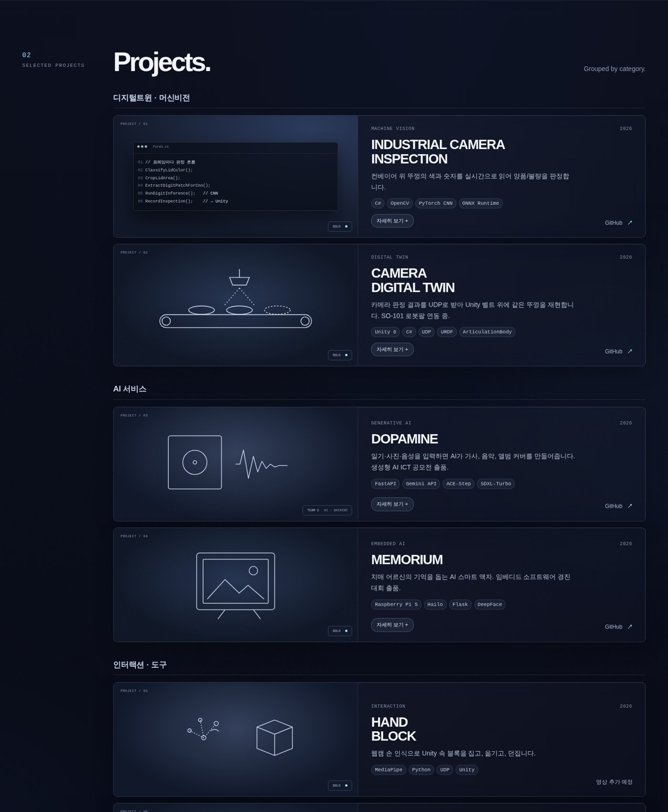
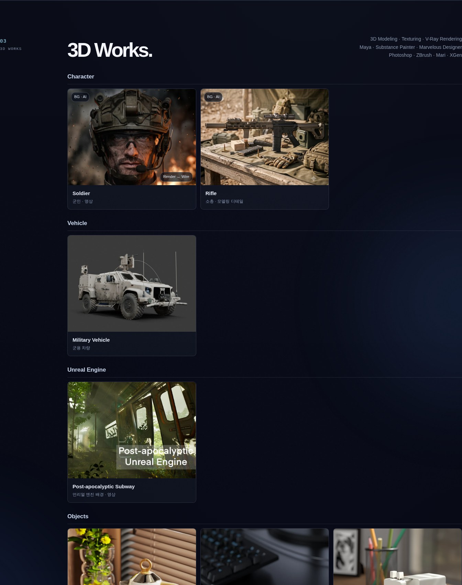

# Subin Jung — Portfolio

**Unity · Machine Vision · 3D Modeling** 작업을 모아 둔 포트폴리오 사이트의 소스 저장소입니다.

### 👉 https://subinlu22.github.io



---

## 사이트 구성

| 섹션 | 내용 |
|---|---|
| About | 분야·경험 키워드 |
| Commit Log | GitHub 커밋 기록 (실시간 연동) |
| Projects | 개발 프로젝트 6개 — 디지털트윈·머신비전 / AI 서비스 / 인터랙션·도구. 카드를 누르면 영상·소개·화면·문제 해결을 열람 |
| 3D Works | Character / Vehicle / Unreal Engine / Objects. 렌더 ↔ 와이어프레임 비교 슬라이더, 영상, 갤러리 |
| Contact | 메일, GitHub |

| Projects | 3D Works |
|---|---|
|  |  |

## 주요 구현

| 기능 | 구현 방식 |
|---|---|
| 히어로 와이어프레임 | 자동차 와이어프레임 이미지에서 직선 구간을 미리 추출해 두고, Canvas로 별똥별 형태의 빛이 그 직선을 따라 이동 |
| 궤도 키워드 | 키워드 칩이 차 주위를 타원 궤도로 회전 (앞쪽은 선명하게, 뒤쪽은 흐리게) |
| 렌더 ↔ 와이어프레임 비교 | 두 이미지를 겹치고 슬라이더 값만큼 `clip-path`로 잘라 표시 |
| 사진 퍼즐 배열 | 이미지의 가로세로 비율을 읽어 한 줄에 놓인 사진의 높이를 같게 맞춤 (자르지 않음) |
| 커밋 기록 | GitHub 공개 기여 기록 API로 달력 렌더링 |
| 상세 보기 | 하나의 `<dialog>`를 3D 작업과 프로젝트 카드가 공유, 유튜브·PDF 삽입 |
| 접근성 / 반응형 | 모바일 레이아웃, `prefers-reduced-motion` 대응 |

## 환경

| 구분 | 내용 |
|---|---|
| 구성 | HTML / CSS / JavaScript (프레임워크 없음) |
| 배포 | GitHub Pages (`main` 브랜치 루트) |
| 이미지 | WebP (원본 해상도 유지) |

## 구조

```
subinlu22.github.io/
├── index.html
├── style.css
├── script.js
└── assets/
    ├── 3d/         # 3D 작업 이미지 (렌더 · 와이어프레임)
    ├── projects/   # 프로젝트 화면 · PDF
    └── hero/       # 히어로 와이어프레임 이미지 · 직선 데이터
```

## 작업물 추가 방법

3D 작업과 프로젝트 카드는 HTML의 `data-*` 속성으로 내용을 지정합니다.

| 속성 | 설명 |
|---|---|
| `data-render` | 대표 이미지 |
| `data-wire` | 와이어프레임 이미지 (있으면 비교 슬라이더) |
| `data-extra` | 추가 이미지 목록 (쉼표로 구분). `파일::설명`, `렌더\|와이어` (비교), `#제목` (묶음 제목), `=` (줄 바꿈) |
| `data-video` | 유튜브 주소 (쉼표로 여러 개) |
| `data-pdf` | PDF 경로 |

## 로컬에서 보기

`index.html`을 브라우저에서 엽니다. (빌드 과정 없음)

---

✉️ kbs5968@naver.com · [GitHub](https://github.com/subinlu22)
